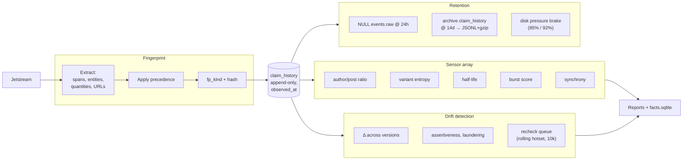

# driftwatch — Dataflow



## Fingerprint precedence

The order matters. Higher-precedence signals win:

```
multi-word entity > quantity+context > URL domain >
single-word entity > spans > normalized text
```

Year exclusion strips bare 19xx/20xx from quantity extraction (treadmill avoidance). Complexity gate (`MIN_CLAIM_ALPHA_TOKENS=3`) skips single-word noise.

## Stage gates

| Stage | Gates |
|-------|-------|
| Ingest | Bounded queue with explicit drop counter; drop_frac surfaced in STATS |
| Fingerprint | Complexity gate; year exclusion; entity stopwords |
| Sensors | Platform health (WARMING_UP/OK/DEGRADED) hard-gates rechecks |
| Drift | Singleton gate (multi-author OR link OR reply-thread); cooldown filter |
| Retention | Disk pressure brake pauses ingest at 92% |

See `../DATAFLOW.md` for stage detail and `../FAILURE_MODES.md` for what each gate prevents.
