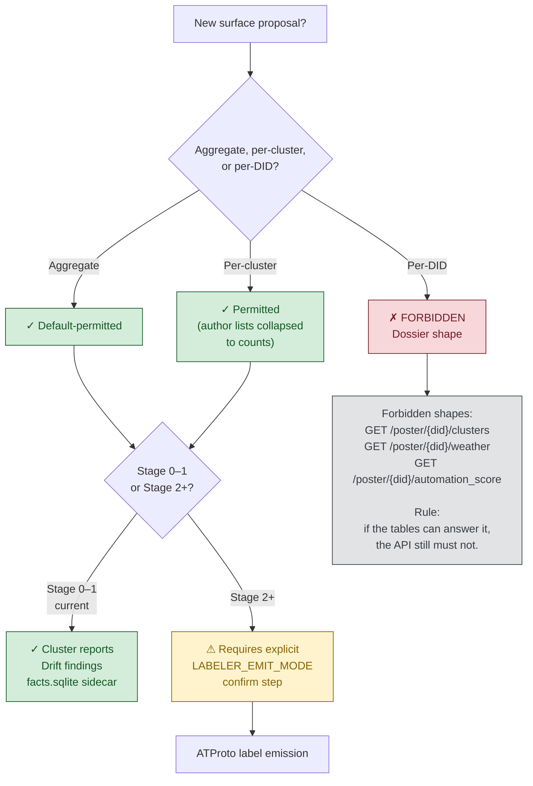

# driftwatch — Publication boundary

The decision tree for whether a proposed surface may be published.

## The two axes

Driftwatch's publication boundary has two orthogonal axes:

1. **Aggregation level** — aggregate / per-cluster / per-DID. Per-DID is forbidden as a surface, full stop.
2. **Stage** — 0–1 (sealed lab, current) / 2+ (public emission, gated by explicit confirm step).

Both axes must be cleared independently. A Stage 0 aggregate is permitted; a Stage 0 per-DID is not. A Stage 2 aggregate requires the emit-mode confirm step; a Stage 2 per-DID is still forbidden.

## Stage gating in detail

`LABELER_EMIT_MODE` defaults to `detect-only`. All decisions land in `label_decisions` (the receipt ledger) regardless of mode. Flipping the gate requires an explicit confirm step in `emit_mode.py`. The gate is not a default that drifts on by accident.

See `../PUBLIC_SURFACES.md` for the full surfaces inventory and `../driftwatch/SCOPE.md` for stage descriptions.
