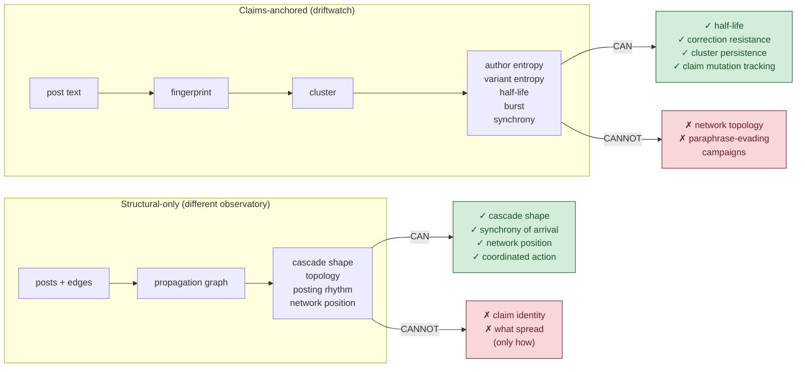

# driftwatch — Signal model fork

The architectural fork between **claims-anchored** (driftwatch's choice) and **structural-only** observatories.

## What each architecture sees

A **coordinated copy-paste campaign** produces both a low-author-entropy claim cluster (claims-anchored sees it) and a tight cascade with synchronous arrival (structural-only sees it). Either approach catches it.

A **paraphrase-evading campaign** is invisible to claims-anchored (no fingerprint match), visible to structural-only (the cascade is still there).

A **viral idea spreading through independent rephrasing** is visible to claims-anchored (variant entropy is high but cluster persists), partially visible to structural-only (shape may look like organic spread).

## Why driftwatch picked claims-anchored

The original question was "do claims persist, mutate, resist correction." That question requires claim identity. Structural-only is a different observatory, not driftwatch's. They are complementary, not interchangeable.

See `../SIGNAL_MODEL.md` for full doctrine on what the structural signals claim and don't claim.
