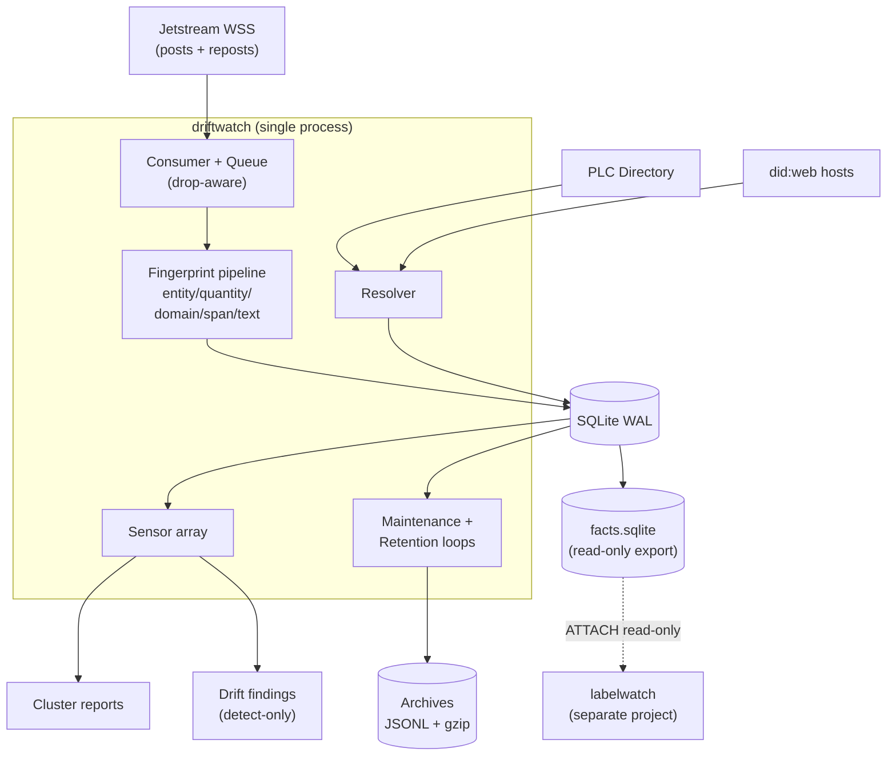

# driftwatch — System overview

## Notes

- Single process, single SQLite DB. The architectural simplicity is the point — every subsystem operates on the shared journal.
- `claim_history` is the central append-only journal. `observed_at` is the trusted timestamp; `createdAt` from the firehose may be wrong.
- facts-bridge is **unidirectional** (driftwatch → labelwatch). Schema changes are data contract changes. See `../PUBLIC_SURFACES.md`.
- See `../OVERVIEW.md` for invariants and population definitions.
